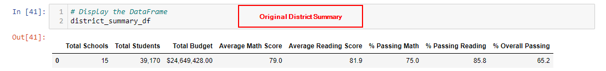
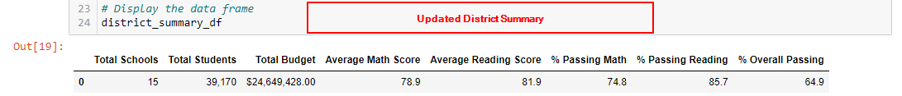
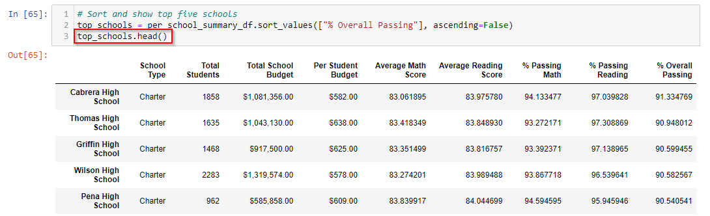
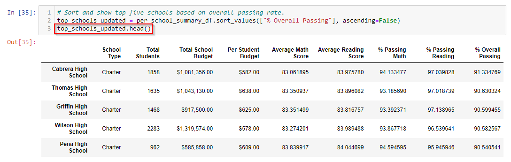
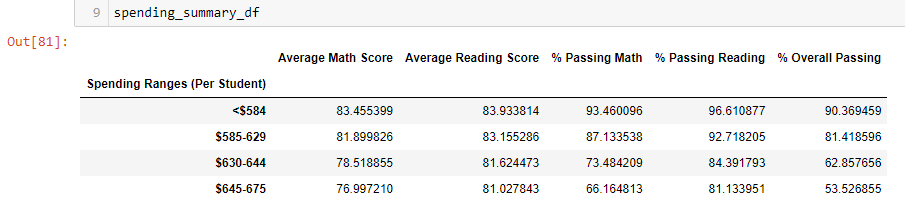
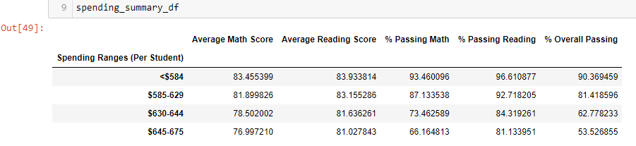
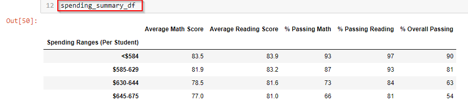

# School District Analysis: PyCitySchools

## Overview of the PyCitySchools District Analysis: 

We previously completed an analysis of schools in the PyCitySchools District that included a district summary, a school summary, and several performance-based summaries (by grade, by school spending, by school size, by school type). 

Since the original school district analysis was completed, the PyCity School Board raised a suspicion that reading and math scores for Thomas High School ninth graders were altered. Given the seriousness of this allegation and possible impact to state testing standards and budgetary implications, the School Board has requested intervention. School Board officials requested that math and reading scores for Thomas High School ninth graders be excluded from the analysis (i.e. replace their scores with NaNs). Once the scores have been excluded, they have requested that the analysis be completed again to determine the impact of these changes on the overall analysis.  

## Results: 
Using bulleted lists and images of DataFrames as support, address the following questions.

### District Summary Analysis:
  - A few of the metrics were not impacted by replacing Thomas High School ninth grade scores for math and reading with NaNs. **Metrics that weren't impacted** include: 
    - **Total Schools**
    - **Total Students**
    - **Total Budget**
  - As anticipated, replacing the scores of the 461 ninth graders at Thomas High School with **NaNs** impacted some of the metrics as outlined below: 
    - **Average Math Score:** This score decreased slightly from 79.0 to 78.9. 
      - We utilized the pandas.DataFrame.mean function() to calculate this score. Because the "skipna" parameter is "True" by default and we didn't specify otherwise, the NaN values are excluded both from the numerator (sum of math scores) as well as the denominator (count of scores) when computing the result.     
    - **Average Reading Score:** This score remained the same.
    - **% Passing Math:** The percentage of students passing math decreased slightly from 75.0% to 74.8%.
    - **% Passing Reading:** The percentage of students passing reading decreased slightly from 85.8% to 85.7%. 
    - **% Overall Passing:** The perdentage of students passing both math and reading decreased from 65.2% to 64.9%. 

### School Summary Analysis:
- **How is the school summary affected?**
  - **Average Math Score:** Thomas High School's score decreased slightly.  
  - **Average Reading Score:** Thomas High School's score increased slightly. 
  - **% Passing Math:** Thomas High School's % of students passing math decreased slightly. 
  - **% Passing Reading:** Thomas High School's % of students passing reading decreased slightly.
  - **% Overall Passing:** Thomas High School's % of students passing both math and reading decreased slightly.
- **How does replacing the ninth graders’ math and reading scores with NaN affect Thomas High School’s performance relative to the other schools?**
  - Despite a decrease in a majority of Thomas High School's metrics after excluding 9th graders' scores, **Thomas High School's ranking based on performance holds steady at #2.**
  - As a result of the update, there is a narrower margin between Thomas High School and the #3 School: Griffin High School.  

- **How does replacing the ninth-grade scores affect the following:**
  - **Math and reading scores by grade:** Because we excluded Thomas High School ninth grader scores for math and reading, the summaries for math and reading scores by grade indicate "nan" in the 9th grade column for Thomas High School. 
  - **Scores by school spending:** 
    - Thomas High School falls in the "Spending Ranges (Per Student)" of $630 - $644. Prior to formatting the columns, there were minor changes in the "630-644" row; however, the updated spending_summary_df is exactly the same after formatting since the minor changes were not enough to change the values upon rounding to 0 or 1 digit after the decimal (depending on the column). 

  - **Scores by school size:** Excluding Thomas High School ninth grader scores did not have any impact on the scores by school size. 
  - **Scores by school type:** Excluding Thomas High School ninth grader scores did not have any impact on the scores by school type.

## Summary: 
Summarize four changes in the updated school district analysis after reading and math scores for the ninth grade at Thomas High School have been replaced with NaNs.
